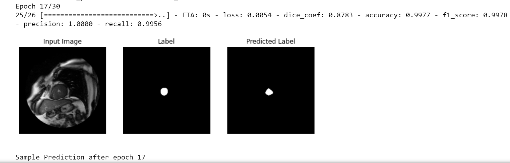
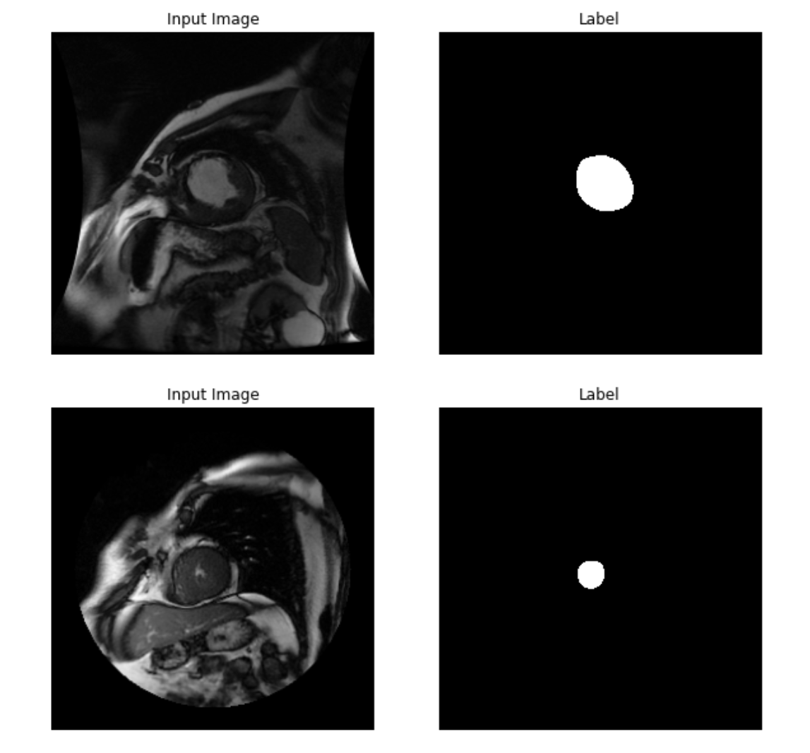
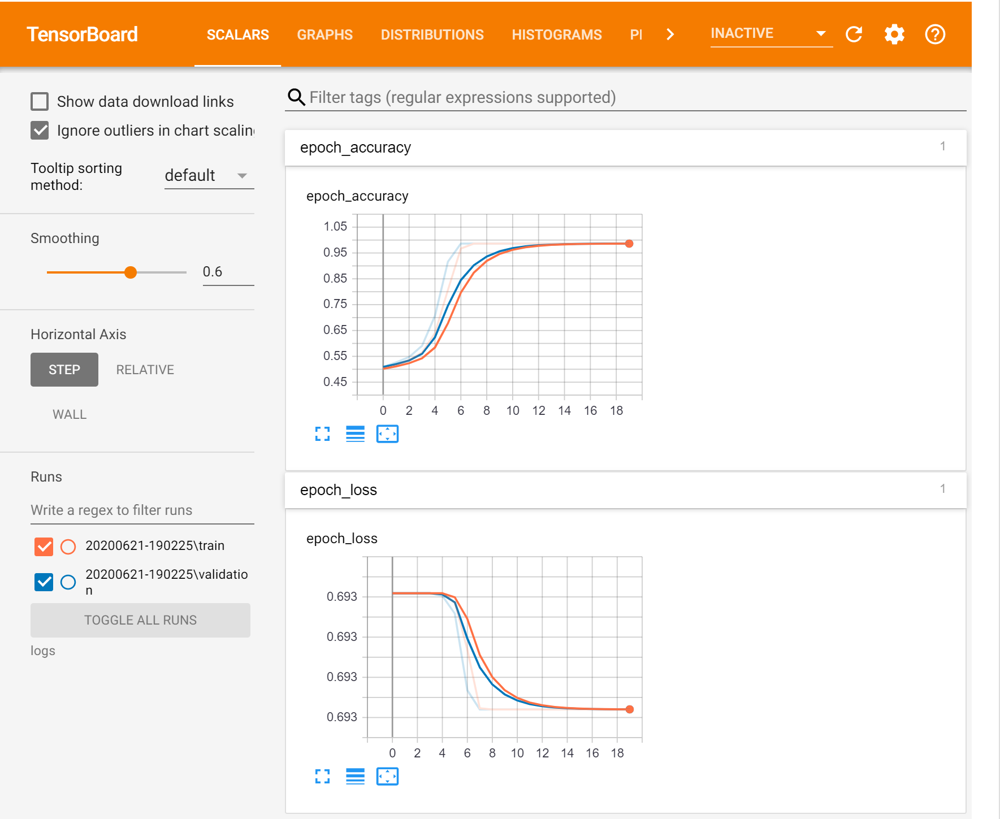

---
languages:
- python
products:
- Azure Machine Learning Service
- Tensorflow 2.0
description: "Image segmentation TensorFlow model for Cardiac MRI's"
---



#  Image Segmentation Cardiac MRI's with Azure Machine Learning Service and TensorFlow 

There are a variety of important image analysis deep learning applications that need to go beyond detecting individual objects within an image and instead segment the image into spatial regions of interest. For example, in medical imagery analysis it is often important to separate the pixels corresponding to different types of tissue, blood or abnormal cells so that we can isolate a particular organ. In this self-paced, hands-on lab we will use the [TensorFlow](https://www.tensorflow.org/) machine learning framework to train and evaluate an image segmentation network using a medical imagery dataset.

## Objectives

* Understand how Neural Networks can solve imaging problems
* Use Transpose Convolutional Neural Networks
* Use Keras and TensorFlow 2 to analyze image data
* Use Azure Machine learning Service

|Technology|
|----------|
|Azure Machine Learning |
|Tensorflow 2.0 |
|Unet Architecture |

## Why Azure Machine Learning Service?


Azure Machine Learning Service give to use the capability to use MLOps techniques, it empowers data scientists and app developers to help bring ML models to production.

This MLOps functionalities that Azure Machine Learning have, enables you to track / version / audit / certify / re-use every asset in your ML lifecycle and provides orchestration services to streamline managing this lifecycle.

### What are the key challenges we wish to solve with?


**Model reproducibility & versioning**
- Track, snapshot & manage assets used to create the model
- Enable collaboration and sharing of ML pipelines

**Model packaging & validation**
- Support model portability across a variety of platforms
- Certify model performance meets functional and latency requirements

**[Not implemented] Model auditability & explainability**
- Maintain asset integrity & persist access control logs
- Certify model behavior meets regulatory & adversarial standards

**[Not implemented] Model deployment & monitoring**
- Release models with confidence
- Monitor & know when to retrain by analyzing signals such as data drift

## Deploy Infrastructure

Follow the next documentation if you dont have Azure Machine Learning up and running yet

#### [Set up Azure Resources with Azure Reource Manager (ARM)](./infrastructure/README.md)


## Virtual environment to execute Azure Machine Learning notebook

### Ananconda and Jupyter Notebook Local

To create the virual environment, we need to have anaconda installed in our computer. It can be downloaded in this [link](https://www.anaconda.com/download/)

- Instalation: https://www.anaconda.com/distribution/
- Conda commands to create local env by environment.yml: ```conda env create -f environment.yml```
- Set conda env into jupyter notebook: ```python -m ipykernel install --user --name <environment_name> --display-name "Python (<environment_name>)"```

Once the environment is created, to activate it:

`conda activate <environment-name>`

To deactivate the environment:

`conda deactivate <environment-name>`

### Dataset

Cardiac MRI short-axis (SAX) scans:

- Sunnybrook cardiac images from earlier competition
http://smial.sri.utoronto.ca/LV_Challenge/Data.html

- "Sunnybrook Cardiac MR Database" is made available under the CC0 1.0 Universal
license described above, and with more detail here:
http://creativecommons.org/publicdomain/zero/1.0/

Original images are 256 x 256 grayscale DICOM format

- Output is a tensor of size 256 x 256 x 2

- Each pixel belongs to one of two classes

- Training set consist of 234 images

- Validation set consist of 26 images

Download here TFrecords: https://drive.google.com/drive/folders/1bYoJMycuKsTg2LUWRKircUzjtQYYGzNf?usp=sharing

#### Attribution: 

Radau P, Lu Y, Connelly K, Paul G, Dick AJ, Wright GA. "Evaluation Framework for
    Algorithms Segmenting Short Axis Cardiac MRI." The MIDAS Journal -Cardiac MR Left
    Ventricle Segmentation Challenge, http://hdl.handle.net/10380/3070

# Image Segmentation

In this repository you will work through a series of exercises performing image segmentation, also called semantic segmentation.  Semantic segmentation is the task of placing each pixel into a specific class.  In a sense it's a classification problem where you'll classify on a pixel basis rather than an entire image.  In this lab the task will be classifying each pixel in a cardiac MRI image based on whether the pixel is a part of the left ventricle (LV) or not.

This lab is not an introduction to deep learning, nor is it intended to be a rigorous mathematical formalism of convolutional neural networks.  We'll assume that you have at least a passing understanding of neural networks including concepts like forward and backpropagation, activations, SGD, convolutions, pooling, bias, and the like.  It is helpful if you've encountered convolutional neural networks (CNN) already and you understand image recognition tasks.  The lab will use Google's TensorFlow machine learning framework so if you have Python and TensorFlow experience it is helpful, but not required.  Most of the work we'll do in this lab is not coding per se, but setting up and running training and evaluation tasks using TensorFlow.


## Input Data Set



The data set you'll be utilizing is a series of cardiac images (specifically MRI short-axis (SAX) scans) that have been expertly labeled.  See  References for full citation information. 

Four representative examples of the data are shown below.  Each row of images is an instance of the data.  On the left are the MRI images and the right are the expertly-segmented regions (often called contours).  The portions of the images that are part of the LV are denoted in white.  Note that the size of LV varies from image to image, but the LV typically takes up a relatively small region of the entire image.

The data extraction from the raw images and then subsequent preparation of these images for ingestion into TensorFlow will not be showcased in this lab.  Suffice it to say that data preparation is a non-trivial aspect of machine learning workflows and is outside the scope of this lab.

For those that are interested in the details, we obtained guidance and partial code from a prior [Kaggle competition](https://www.kaggle.com/c/second-annual-data-science-bowl/details/deep-learning-tutorial) on how to extract the images properly.  At that point we took the images, converted them to TensorFlow records (TFRecords), and stored them to files.  [TFRecords](https://www.tensorflow.org/programmers_guide/reading_data) are a special file format provided by TensorFlow, which allow you to use built-in TensorFlow functions for data management including multi-threaded data reading and sophisticated pre-processing of the data such as randomizing and even augmenting the training data.

The images themselves are originally 256 x 256 grayscale [DICOM](https://en.wikipedia.org/wiki/DICOM) format, a common image format in medical imaging.  The label is a tensor of size 256 x 256 x 2.  The reason the last dimension is a 2 is that the pixel is in one of two classes so each pixel label has a vector of size 2 associated with it.  The training set is 234 images and the validation set (data NOT used for training but used to test the accuracy of the model) is 26 images.

# TensorBoard

In this experiment we generate TensorFlow logs. Tensorboard allows you to visualize many aspects of your program. In TensorBoard, you can see a visual representation of your computation graph and you can plot different metrics of your computation such as loss, accuracy, and learning rate.  Essentially any data that is generated during the execution of TensorFlow can be visually displayed by TensorBoard with the addition of a few extra API calls in your program.

Inside aml-pipeline.ipynb notebook you have the correspondant cells to execute Tensorboard after model training.



Tensorboard hooks into Keras through a [training callback](https://www.tensorflow.org/api_docs/python/tf/keras/callbacks/TensorBoard)

<a id="References"></a>
# References

Thanks to **NVIDIA** and **Tensorflow** Community for give the facilities to obtains this kind of dataset and lend for everyone the opportunity to train, analyze and prove this kind of images that usually we found that are private.

- [Tensorflow 2.0](https://www.tensorflow.org/learn)
- [Azure Machine Learning](https://azure.microsoft.com/es-es/services/machine-learning/)
- [UNET](https://arxiv.org/abs/1505.04597)

<a id="1"></a>
[1] Sunnybrook cardiac images from earlier competition https://smial.sri.utoronto.ca/LV_Challenge/Data.html

<a id="2"></a>
[2] This "Sunnybrook Cardiac MR Database" is made available under the CC0 1.0 Universal license described above, and with more detail here: https://www.cardiacatlas.org/studies/sunnybrook-cardiac-data/

<a id="3"></a>
[3] Attribution:
Radau P, Lu Y, Connelly K, Paul G, Dick AJ, Wright GA. "Evaluation Framework for Algorithms Segmenting Short Axis Cardiac MRI." The MIDAS Journal -Cardiac MR Left Ventricle Segmentation Challenge, http://hdl.handle.net/10380/3070

<a id="4"></a>
[4] http://fcn.berkeleyvision.org/

<a id="5"></a>
[5] Long, Shelhamer, Darrell; "Fully Convoutional Networks for Semantic Segmentation", CVPR 2015.

<a id="6"></a>
[6] Zeiler, Krishnan, Taylor, Fergus; "Deconvolutional Networks", CVPR 2010.

<a id="7"></a>
[7] https://www.kaggle.com/c/second-annual-data-science-bowl/details/deep-learning-tutorial

<a id="8"></a>
[8] https://www.tensorflow.org/tutorials/images/segmentation